# Bedroom (First Floor)

> Master bedroom with ensuite bathroom and wardrobe -- presence-aware lighting, automated covers, smart humidifier control, and per-person bedside switches.

**Package:** `bedroom` | **Path:** `packages/areas/first-floor/bedroom/`
**Floor:** First floor (Piętro) | **Area:** 16.65 m² (bedroom) + 5.24 m² (ensuite) + 3.52 m² (wardrobe)

## How It Works

### Lighting

<!-- svg:keep -->

<!-- /svg:keep -->

When someone enters the bedroom and it is dark, the bed stripe turns on automatically. During daytime (non-sleeping hours) it comes on at 50% warm white (2951 K); during sleeping time it dims to 1% to avoid waking anyone. If movie mode is enabled, presence-based lighting is suppressed entirely so the room stays dark.

Bed lights and non-bed lights are mutually exclusive. Turning on any bedside lamp (`light.bedroom_jakub`, `light.bedroom_sona`, LEDs, main, or reflectors) automatically kills the bed stripe. Turning on the bed group switches off the non-bed lights. This prevents conflicting light scenes from stacking.

If the bedroom is vacant for 10 minutes, the bedroom lights (LEDs, main, reflectors, bed stripe) are force-turned off as a safety net. The ensuite is **not** swept by this timeout -- it self-manages its own lights (see below).

### Ensuite Bathroom

The ensuite runs a three-layer design: an occupancy **latch**, a lights automation, and a manual-override.

**Occupancy latch.** `input_boolean.ensuite_occupied` is the single source of truth for "someone's in", and `binary_sensor.ensuite_bathroom_occupancy` mirrors it. The latch is set on door-open, PIR motion (entrance), or mmWave presence (shower). It holds through stillness -- standing in the shower or sitting on the toilet keeps mmWave active so the lights never drop. It clears only when **both** the PIR and the mmWave read clear: either 15 s after the door closes, or after a 10-minute open-door safety timeout. The two sensors cover different zones -- the PIR is aimed at the entrance (fast entry detect), the mmWave at the shower/main area -- so the PIR going clear alone never clears the latch.

**Lights.** While the latch is on and the room is dark, the ensuite lights come on. During the day they come on at 20% -- or 100% if the bedroom lights are already on. At night (23:00--07:30), only a single bulb (`light.en_suite_bulb_top_middle`) comes on at 1% to avoid blinding anyone. If the room becomes dark while already occupied (dusk crossing the threshold), the lights catch up rather than waiting for the next entry. When the latch clears, the bulbs turn off.

**Power relay.** `light.ensuite_bathroom_main_power` ("Main") is a relay that is the hard power feed for the six Zigbee bulbs -- cutting it makes the bulbs go unavailable. So the automations **never turn the relay off**; "off" turns the bulbs off and leaves the relay on. The relay stays on continuously, so every turn-on path just ensures it's on (a no-op in normal operation) and then commands the bulbs -- no settle delay needed.

**Manual override.** Pressing the wall switch sets `input_boolean.ensuite_manual_override`, which suspends the presence automation so motion can't stomp your choice. An off/toggle-off press clears the override and hands control back to auto. A safety timeout clears the override after 15 minutes with no presence so it never sticks forever.

<!-- svg:keep -->

<!-- /svg:keep -->

### Wardrobe

The wardrobe light turns on when `binary_sensor.bedroom_wardrobe_occupancy` detects someone. If the light was turned on by automation (changed less than 5 minutes ago), it turns off after 30 seconds of vacancy. If it was turned on manually, the automation leaves it alone but forces it off after 30 minutes of vacancy as a cleanup safety net.

<!-- svg:keep -->

<!-- /svg:keep -->

### Covers

Bedroom window covers close automatically at sunset (when `binary_sensor.dark_for_curtains` activates) and 1 hour before sunrise (to prevent early morning light from waking anyone). On weekday mornings, covers open when sleeping time ends. Weekends are excluded -- covers stay closed until manually opened.

<!-- svg:keep -->

<!-- /svg:keep -->

### Humidifier

The humidifier uses a three-layer control system: a standalone humidity sensor (`sensor.bedroom_hygro_humidity`), a hysteresis flag, and a proportional fan speed controller.

**Humidity targeting** reads from the dedicated hygro sensor (more accurate and always-on, unlike the humidifier's built-in sensor). Thresholds shift depending on the time of day:

| Period | Activate below | Deactivate at |
|--------|---------------|---------------|
| Comfort (bed time or after 21:00) | 45% | 50% |
| Daytime | 35% | 40% |

When humidity reaches the target, `input_boolean.bedroom_humidification_active` turns off. The humidifier stays physically on -- only the fan speed changes.

**Fan speed** is proportional to the humidity gap (how far below target), computed by `sensor.bedroom_humidifier_target_speed`. The further from target, the harder the fan works -- but capped by presence and time of day:

| Humidity gap | Base speed | Occupied cap | Vacant cap |
|-------------|-----------|-------------|-----------|
| < 3% | 20% | 20% | 20% |
| 3--6% | 40% | 40% | 40% |
| 6--10% | 60% | 40% | 60% |
| > 10% | 80% | 40% | 60% |

Night mode (bed time) always overrides to 20% with the display turned off. Morning restores the display and re-evaluates speed. The target speed sensor exposes debug attributes (humidity, gap, mode, max_speed, presence) visible in Developer Tools.

<!-- svg:keep -->

<!-- /svg:keep -->

### Climate (AC evening cooldown)

The AC (`climate.bedroom`) auto-cools the room before bedtime. In the evening window (21:00--23:00), if the room climbs over 25 °C for 5 minutes, the AC switches to **cool** mode targeting **22 °C**. It turns itself off once the room drops to **23 °C or below** (a 2 °C hysteresis band below the on-threshold prevents rapid on/off cycling). A safety backstop turns the AC off after **3 hours** of continuous cooling regardless of temperature -- protection against a stuck or wrong sensor that never reaches the off-point.

Temperature is read through an **overlay sensor** (`sensor.bedroom_temperature`) that mirrors a chosen physical source (currently `sensor.bedroom_fp300_temperature`, the FP300 presence-sensor ambient reading). To change which physical sensor drives cooling, edit the one source line in the overlay template -- the automations never reference the raw sensor.

The on-automation skips when the AC is `unavailable` (e.g. off-season) and won't re-issue if already cooling. The off-automation and safety timeout only act while the AC is in `cool` mode, so they never fight a manual heat/fan session.

### Wall Button Switch (dual-button, near door)

| Button | Press | Effect |
|--------|-------|--------|
| Left | Single | Toggle main light |
| Right | Single | Toggle LEDs (with power relay) |
| Right | Double | Cycle LED color (Warm White, Soft Purple, Deep Blue, Amber, Coral, Lavender) |
| Left | Hold | Decrease LED brightness by 20% |
| Right | Hold | Increase LED brightness by 20% |

Hold actions only work when the LEDs are already on.

### Jakub's Bedside Switch (4-button)

| Button | Press | Effect |
|--------|-------|--------|
| 1 | Single | Toggle Jakub's bedside lamp |
| 3 | Single | Toggle LEDs |
| 1 | Hold | Turn off all bedroom lights |
| 3 | Hold | Turn off all lights in the house |
| 2 | Single | Open covers |
| 4 | Single | Close covers |
| 2 | Double | Stop covers |
| 4 | Double | Set covers to 20% |

### Sona's Bedside Switch (4-button)

| Button | Press | Effect |
|--------|-------|--------|
| 2 | Single | Toggle Sona's bedside lamp |
| 4 | Single | Toggle LEDs |
| 2 | Hold | Turn off all bedroom lights |
| 4 | Hold | Turn off all lights in the house |
| 2 | Double | Increase Sona bulbs brightness +20% |
| 4 | Double | Decrease Sona bulbs brightness -20% (floors at 1%) |
| 1 | Single | Open covers |
| 3 | Single | Close covers |
| 1 | Double | Stop covers |
| 3 | Double | Set covers to 20% |

### Sona's Dial Switch (rotary + 3 buttons)

The dial controls different entities depending on which button was last pressed. Rotating the dial adjusts brightness (for lights) or position (for covers) of the currently selected target.

| Button | Effect |
|--------|--------|
| 1 | Toggle Sona lamp, set dial target to **light** |
| 2 | Toggle reflectors, set dial target to **reflectors** |
| 3 | Toggle cover, set dial target to **cover** |
| Rotation | Adjust the current target's brightness or position |

The dial target resets back to "light" after 30 seconds of inactivity to prevent accidentally adjusting the wrong entity.

### Ensuite Bathroom Switch (dual-button)

| Button | Press | Effect |
|--------|-------|--------|
| Left | Single | Toggle main ceiling bulbs + set/clear manual override |
| Right | Single | Turn on main bulbs at 100% + set manual override |

Both presses set the manual override (so presence stops driving the lights); the left toggle clears the override when it turns the lights off, restoring automatic behaviour. Either way the relay is ensured on before the bulbs are commanded.

## Gotchas

- **Light exclusivity is immediate**: turning on any non-bed light kills the bed stripe and vice versa -- this is intentional to keep the room in a single lighting mode
- **Movie mode** blocks all automatic lighting; it must be toggled off manually (e.g., via the UI) for presence automation to resume
- **Presence turn-off only kills the bed stripe**, not all lights -- the 10-minute bedroom vacancy timeout handles the full bedroom sweep (ensuite is excluded and self-manages)
- **Never cut the ensuite power relay to turn lights off**: `light.ensuite_bathroom_main_power` feeds the six Zigbee bulbs -- cutting it makes them go unavailable. Turn the bulbs off, leave the relay on. (See the `relay-feeds-zigbee-bulbs` knowledge leaf.) The `light.ensuite_bathroom_main_with_power` group is a trap and is no longer used by automations.
- **Ensuite latch clears only when BOTH sensors are clear**: the PIR (entrance) going clear alone never clears it -- the mmWave (shower) must also be clear, so someone in the shower keeps the lights on
- **Covers skip weekends**: the morning open only fires Monday through Friday
- **Cover close fires twice**: once at sunset and once 1 hour before sunrise (catches the case where covers were manually opened at night)
- **Humidifier never turns off physically** -- the `bedroom_humidification_active` flag only changes fan speed between idle (20%) and active (proportional 20--60%)
- **Humidity is read from `sensor.bedroom_hygro_humidity`**, not the humidifier's built-in sensor -- the hygro sensor is more accurate and stays available when the humidifier is off
- **Ensuite brightness depends on bedroom lights**: if bedroom lights are on, ensuite comes on at 100%; otherwise 20% during the day
- **Wardrobe 30-second vs 30-minute off**: short delay for automation-triggered on, long safety delay for manually-triggered on (detected by checking `last_changed` age)
- **`bedroom_presence` is gone**: the whole-room presence sensor was lost in an FP2 reconfig and is not coming back. All references to `binary_sensor.bedroom_presence` have been removed -- the presence off-branch and the vacancy timeout now key off `binary_sensor.bedroom_entrance_presence` (the live FP2 entrance zone), and the humidifier occupied fan-cap is hardcoded unoccupied (always uses the vacant fan caps). The other gone zoned/bed-side sensors (`bedroom_walking_area_presence`, `presence_sensor_bedroom_jakub_side`, `presence_sensor_bedroom_sona_side`) were also removed.
- **`bedroom_is_dark` reads in-room lux from the FP300**: sources `sensor.presence_multi_sensor_fp300_illuminance_2` ("Bedroom Presence Illuminance"). Outdoor darkness (`binary_sensor.outdoor_is_dark`) short-circuits to dark; otherwise a hysteresis threshold applies -- claims dark below 7 lx, releases at or above 10 lx (anti-flicker). Matches the living-room/kitchen `is_dark` pattern. (Earlier this mirrored outdoor darkness only, as a stand-in while the room had no lux source.)
- **AC cooldown reads the overlay, not the raw sensor**: all three AC automations key off `sensor.bedroom_temperature`, which mirrors `sensor.bedroom_fp300_temperature`. Swap the source in `templates/sensors/bedroom_temperature.yaml` -- never point automations at a physical temp sensor directly. Most bedroom `*_device_temperature` entities are Zigbee chip temps that run hot (38--42 °C) and are NOT valid room-ambient readings.
- **AC off uses `below: 23.1`**: `numeric_state below` is strict (`<`), so 23.1 makes a 23.0 reading trigger the off while 23.2+ does not -- this implements "at or below 23 °C".
- **AC cooldown only auto-starts in the 21:00--23:00 window**: outside it the room can sit above 25 °C with no auto-on. Already-running cooling is still ended by hysteresis/safety at any hour.

## Entities

**Lights:** `light.bedroom` (master group), `light.bedroom_bed` (Jakub + Sona bedside), `light.bedroom_non_bed` (LEDs power + main + reflectors), `light.bedroom_leds_with_power`, `light.bedroom_reflectors_with_power`, `light.bedroom_sona_with_power`, `light.bed_stripe`, `light.bedroom_wardrobe`
**Ensuite lights:** `light.ensuite_bathroom` (all -- the OFF target), `light.ensuite_bathroom_main` (6 ceiling bulbs -- the ON target), `light.ensuite_bathroom_main_power` (relay, hard power feed -- never turned off). `light.ensuite_bathroom_main_with_power` exists but is retired from automations.
**Sensors:** `binary_sensor.bedroom_is_dark`, `binary_sensor.ensuite_bathroom_is_dark`, `binary_sensor.ensuite_bathroom_occupancy` (mirrors the occupancy latch), `sensor.bedroom_humidifier_target_speed`, `sensor.bedroom_temperature` (AC overlay -- mirrors the chosen physical temp source)
**Climate:** `climate.bedroom` (AC unit -- evening cooldown to 22 °C)
**State:** `input_boolean.bedroom_movie_mode`, `input_boolean.bedroom_humidification_active`, `input_boolean.ensuite_occupied` (ensuite occupancy latch), `input_boolean.ensuite_manual_override` (ensuite wall-switch override), `input_select.bedroom_leds_color`, `input_select.sona_dial_rotation_target`

## Dependencies

- `binary_sensor.outdoor_is_dark` -- global darkness sensor (used by dark templates)
- `binary_sensor.sleeping_time` -- global sleeping schedule (presence lighting, covers)
- `binary_sensor.bed_time` -- global bed time schedule (humidifier night mode, humidity targets)
- `binary_sensor.dark_for_curtains` -- global curtain darkness threshold (cover close trigger)
- `binary_sensor.bedroom_entrance_presence` -- FP2 entrance-zone presence; the only live bedroom presence source (drives presence lighting + vacancy timeout)
- `binary_sensor.ensuite_bathroom_presence` -- ensuite mmWave presence (shower/main zone, holds through stillness)
- `binary_sensor.ensuite_bathroom_motion` -- ensuite PIR motion (entrance zone, fast)
- `binary_sensor.ensuite_door` -- ensuite door contact sensor
- `binary_sensor.bedroom_wardrobe_occupancy` -- wardrobe occupancy sensor
- `cover.bedroom` -- bedroom window covers
- `climate.bedroom` -- bedroom AC unit (evening cooldown target)
- `sensor.bedroom_fp300_temperature` -- FP300 presence-sensor ambient temp (current source behind the AC overlay)
- `humidifier.bedroom` -- bedroom humidifier device
- `fan.bedroom_humidifier` -- humidifier fan entity
- `light.bedroom_humidifier_display` -- humidifier display backlight
- `sensor.ensuite_bathroom_illuminance` -- ensuite illuminance sensor
- `sensor.bedroom_hygro_humidity` -- standalone humidity sensor (more accurate than humidifier built-in)

## File Index

| File | Purpose |
|------|---------|
| `config.yaml` | Input booleans, input selects, package includes |
| `automations/bedroom_presence.yaml` | Presence-based bed stripe on/off |
| `automations/bedroom_lights_exclusivity.yaml` | Mutual exclusion between bed and non-bed lights |
| `automations/bedroom_vacancy_timeout.yaml` | 10-min vacancy safety off for bedroom lights (ensuite excluded) |
| `automations/bedroom_button_switch.yaml` | Dual-button wall switch (main light, LEDs, colors) |
| `automations/bedroom_scene_switch_jakub.yaml` | Jakub's 4-button bedside switch |
| `automations/bedroom_scene_switch_sona.yaml` | Sona's 4-button bedside switch |
| `automations/bedroom_sona_dial_switch.yaml` | Sona's rotary dial (brightness/cover control) |
| `automations/bedroom_sona_dial_rotation_reset.yaml` | Auto-reset dial target to "light" after 30s |
| `automations/bedroom_cover_windows_when_sunset.yaml` | Close covers at sunset and before sunrise |
| `automations/bedroom_uncover_windows_when_sleeping_time_off.yaml` | Open covers on weekday mornings |
| `automations/bedroom_ac_cooldown_on.yaml` | AC to cool@22°C when >25°C in the 21:00--23:00 window |
| `automations/bedroom_ac_cooldown_off.yaml` | AC off when room cools to ≤23°C (hysteresis) |
| `automations/bedroom_ac_safety_timeout.yaml` | AC off after 3h continuous cooling (safety backstop) |
| `automations/bedroom_humidifier_on_off.yaml` | Humidity threshold control (activate/deactivate flag) |
| `automations/bedroom_humidifier_fan_speed.yaml` | Apply computed fan speed and manage display |
| `automations/ensuite_occupancy_state_machine.yaml` | Ensuite occupancy latch (door + PIR + mmWave entry/exit) |
| `automations/ensuite_bathroom_presence.yaml` | Ensuite lights from the latch (relay-ensure, night mode, override-aware) |
| `automations/ensuite_bathroom_lights_switch.yaml` | Ensuite dual-button wall switch (sets/clears manual override) |
| `automations/ensuite_manual_override_timeout.yaml` | Clears ensuite manual override after 15 min of no presence |
| `automations/wardrobe_lights_on_when_occupied.yaml` | Wardrobe occupancy-based light with dual timeout |
| `lights/bedroom.yaml` | Master bedroom light group |
| `lights/bedroom_bed.yaml` | Bed lights group (Jakub + Sona) |
| `lights/bedroom_non_bed.yaml` | Non-bed lights group (LEDs power, main, reflectors) |
| `lights/bedroom_leds_with_power.yaml` | LEDs + power relay group |
| `lights/bedroom_reflector_bulbs.yaml` | 8 individual reflector bulbs group |
| `lights/bedroom_reflectors_with_power.yaml` | Reflectors + power relay group |
| `lights/bedroom_sona_bulbs.yaml` | Sona's high + low bulbs group |
| `lights/bedroom_sona_with_power.yaml` | Sona bulbs + power relay group |
| `lights/ensuite_bathroom.yaml` | All ensuite lights group |
| `lights/ensuite_bathroom_main.yaml` | 6 ensuite ceiling bulbs group |
| `lights/ensuite_bathroom_main_with_power.yaml` | Ensuite main + power relay group |
| `templates/binary_sensors/bedroom_is_dark.yaml` | Bedroom darkness with hysteresis (5/8 lux) |
| `templates/binary_sensors/ensuite_bathroom_is_dark.yaml` | Ensuite darkness with hysteresis (6/10 lux) |
| `templates/binary_sensors/ensuite_bathroom_occupancy.yaml` | Ensuite occupancy: mirrors `input_boolean.ensuite_occupied` latch |
| `templates/sensors/bedroom_humidifier_target_speed.yaml` | Proportional fan speed based on humidity gap, presence, time |
| `templates/sensors/bedroom_temperature.yaml` | AC overlay sensor -- mirrors the chosen physical temp source |
