# Garden

> Automated irrigation for 3 lawn zones and drip irrigation, driven by mode profiles with weather-aware scheduling.

**Package:** `garden` | **Path:** `packages/areas/outdoor/garden/`

## How It Works

### Scheduled Irrigation

<!-- svg:keep -->

<!-- /svg:keep -->

Single daily trigger:

- **04:00** — picks lawn+drip (full), lawn-only, or drip-only based on profile + per-type skip sensors. Drip runs once per day on the same days as lawn.

A **one-off run** can be armed from the dashboard (pick type + datetime, tap Schedule). It fires once at the chosen time, independent of the recurring schedule and ignoring rain skip. It aborts if any valve is already open or any irrigation script is running, and disarms itself at fire time.

Per-type skip:

- **Lawn skip** — lawn season (May–Sep), raining now, or rain forecast within 6h.
- **Drip skip** — drip season (May–Oct) or raining now. No forecast lookahead — drip OK with rain coming since foliage stays dry.

### Modes

`input_select.garden_irrigation_mode` controls everything. The mode persists across HA restarts. Named modes ignore the calendar month — they run as configured. Only Smart inspects the month.

| Mode | Per-zone lawn (z1 / z2 / z3) | Lawn total | Lawn freq | Drip dur | Drip freq |
|------|------|------|------|------|------|
| **Manual** | — | — | — | — | — |
| **Eco** | 30m / 18m / 18m | 1h06 | Tue + Sat (2×/wk) | 45m ×1/day | Tue + Sat |
| **Standard** | 30m / 18m / 18m | 1h06 | Tue + Thu + Sat (3×/wk) | 45m ×1/day | Tue + Thu + Sat |
| **Intensive** | 35m / 20m / 20m | 1h15 | Mon + Tue + Thu + Fri (4×/wk) | 45m ×1/day | Mon + Tue + Thu + Fri |
| **Testing** | 30s / 30s / 30s | 90s | daily | 30s ×1/day | daily |
| **Smart** | per month (see below) | — | per month | per month | per month |

Eco and Standard share durations — they differ only in frequency (deep + infrequent vs steady summer). Intensive bumps both for peak heat.

**Smart mode by month:**

| Month | Inherits | Lawn freq | Drip freq |
|-------|----------|-----------|-----------|
| May–Jun | Standard | Tue + Thu + Sat | Tue + Thu + Sat |
| Jul–Aug | Intensive | Mon + Tue + Thu + Fri | Mon + Tue + Thu + Fri |
| Sep | Eco | Tue + Sat | Tue + Sat |
| Oct | drip-only | — | 45m every 3 days |
| Nov–Apr | OFF | — | — |

Per-zone durations are written explicitly in the profile (no ratio split). `zone_1` runs longest (biggest / sunniest, south slope); `zone_2` and `zone_3` are equal.

**Cycle & soak:** lawn runs zones 1→2→3, repeated `cycle_count` (2) times with a `soak_minutes` (15m) pause between cycles. `lawn_durations` is the TOTAL per-run water — auto-off divides each valve open by `cycle_count` so the sum across cycles equals it. Soak lets water sink in on the slope instead of running off. Drip stays single-pass.

### How Valves Are Controlled

The **auto-off automation** is the single source of truth for durations. Any valve that opens — schedule, script, or HomeKit — gets automatically closed after the profile-driven duration. Scripts open valves and wait for them to close.

The **lawn irrigation script** runs zones sequentially. The **full irrigation script** chains lawn → drip.

### Cleanup Safety

The cleanup automation closes all valves when an irrigation script ends. To avoid killing the parent during chained runs, it skips when `script.garden_full_irrigation` is still running.

### On-Demand Control

All 4 valves and 3 sequence scripts are exposed to **HomeKit**:

- Open any individual valve — auto-off handles the duration
- Close any valve — stops immediately
- Trigger `script.garden_lawn_irrigation` — runs all 3 zones sequentially
- Trigger `script.garden_drip_irrigation` — drip only
- Trigger `script.garden_full_irrigation` — lawn zones then drip

## Gotchas

- **Valves can't run simultaneously** — the Tuya controller doesn't support it.
- **Auto-off reads duration at valve-open time** — changing mode mid-run won't affect an already-running valve.
- **Zones 5-8 on the Tuya controller are unused** — hardware supports 4 zones.

## Entities

**Valves:** `valve.lawn_sprinkler_zone_1`, `valve.lawn_sprinkler_zone_2`, `valve.lawn_sprinkler_zone_3`, `valve.drip_irrigation`

**Mode:** `input_select.garden_irrigation_mode` — Manual / Eco / Standard / Intensive / Testing / Smart

**One-off run:**
- `input_select.garden_oneoff_type` — Lawn / Drip / Full
- `input_datetime.garden_oneoff_at` — when the one-off fires
- `input_boolean.garden_oneoff_armed` — on = armed; auto-clears at fire time

**Sensors:**
- `binary_sensor.garden_lawn_should_skip` — on = skip lawn
- `binary_sensor.garden_drip_should_skip` — on = skip drip
- `binary_sensor.garden_should_skip_irrigation` — legacy alias of lawn skip
- `sensor.garden_irrigation_profile` — resolved schedule. Attributes: `effective_mode` (named mode, or Smart's month-resolved tier), `lawn_durations` (per-zone seconds dict), `cycle_count`, `soak_minutes`, `drip_duration`, `drip_runs_per_day`, `lawn_today`, `drip_today`

**Scripts:**
- `script.garden_lawn_irrigation` — zones 1→2→3 sequential
- `script.garden_drip_irrigation` — drip only
- `script.garden_full_irrigation` — lawn then drip

## Dependencies

- `binary_sensor.raining` — current rain state
- `weather.forecast_home` — Met.no, used for 6h rain forecast (lawn only)

## File Index

| File | Purpose |
|------|---------|
| `config.yaml` | Package entry, input_select definition |
| `automations/garden_valve_auto_off.yaml` | Auto-closes valves after profile duration |
| `automations/garden_scheduled_irrigation.yaml` | 04:00 trigger with per-type skip |
| `automations/garden_oneoff_run.yaml` | Fires a single armed run (Lawn/Drip/Full) at the chosen datetime, then disarms. Aborts if already irrigating. Ignores rain skip. |
| `automations/garden_irrigation_cleanup.yaml` | Closes all valves on script end (skips when parent full irrigation running) |
| `scripts/garden_lawn_irrigation.yaml` | Sequential zones 1→2→3 |
| `scripts/garden_drip_irrigation.yaml` | Drip valve with wait-for-close |
| `scripts/garden_full_irrigation.yaml` | Chains lawn + drip |
| `templates/garden_should_skip_irrigation.yaml` | Lawn + drip skip sensors |
| `templates/garden_irrigation_profile.yaml` | Mode → duration/days mapping |
